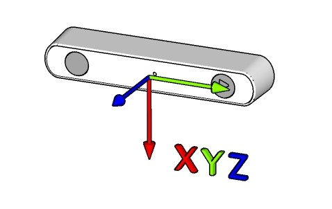

<p align="center">
  <a href="https://www.stereolabs.com">  </a>

<h1 align="center">
  ZED OPEN CAPTURE API
  <br>
</h1>

<h4 align="center">Low level camera driver for the ZED stereo camera family</h4>

<p align="center">
  <a href="#key-features">Key Features</a> •
  <a href="#installation">Install</a> •
  <a href="#documentation">Documentation</a> •
  <a href="#usage-guide">Run</a> •
  <a href="#get-video-data">Get Video Frames</a> •
  <a href="#get-sensors-data">Get Sensors Data</a> •
  <a href="#coordinates-system">Coordinates</a> •
  <a href="#license">License</a>
</p>

The ZED Open Capture library allows the low level control of ZED, ZED Mini and ZED 2 camera. The library provides methods to access raw video frames, to control the video parameters and to acquire raw data from the internal sensors (only ZED Mini and ZED2). A synchronization mechanism is provided to get the correct sensor data associated to each video frame.

**Note:** The provided data are not calibrated, images are not rectified in a stereoscopic way, IMU data may drift or be misaligned.
Calibration data can be accessed using the [ZED SDK](https://www.stereolabs.com/developers/release/).

[Online documentation](https://stereolabs.github.io/zed-open-capture)

## Key Features
 * Video grabbing
    - YUV 4:2:2 data format
    - Camera runtime control
 * Sensors data grabbing
    - 6 DOF IMU (Accelerometer + Gyroscope)
    - 3 DOF Magnetometer 
    - Environment (Pressure + Temperature + Humidity)
    - CMOS sensors temperature
 * Sensors + Video synchronization
 * Full set of self-explaining examples
    - [Video capture](https://github.com/stereolabs/zed-open-capture/blob/fix_doc/examples/zed_oc_video_example.cpp)
    - [Video capture and camera control](https://github.com/stereolabs/zed-open-capture/blob/fix_doc/examples/zed_oc_control_example.cpp)
    - [Video rectification](https://github.com/stereolabs/zed-open-capture/blob/fix_doc/examples/zed_oc_rectify_example.cpp)
    - [Sensors capture](https://github.com/stereolabs/zed-open-capture/blob/fix_doc/examples/zed_oc_sensors_example.cpp)
    - [Video/Sensors synchronization](https://github.com/stereolabs/zed-open-capture/blob/fix_doc/examples/zed_oc_sync_example.cpp)

## Installation

### Prerequisites

 * A Stereolabs camera: [ZED](https://www.stereolabs.com/zed/), [ZED Mini](https://www.stereolabs.com/zed-mini/), [ZED2](https://www.stereolabs.com/zed-2/)
 * Linux OS [Tested on Ubuntu 16.04, 18.04 and 20.04]
 * GCC compiler [at least v7.5]
 * CMake build system [at least v3.1] 
 * HIDAPI and LIBUSB Libraries for USB communication
 * OpenCV [at least v3.4. Required only by examples]
 * git [if installing from source]

#### Install prerequisites

* Install GCC compiler and build tools

    `$ sudo apt install build-essential`

* Install CMake build system

    `$ sudo apt install cmake`

* Install HIDAPI and LIBUSB libraries:

    `$ sudo apt install libusb-1.0-0-dev libhidapi-libusb0 libhidapi-dev`

* Install OpenCV to compile the examples

    `$ sudo apt install opencv-dev`

### Install the udev rule 
To be able to access the USB you must install the udev rule contained in the `udev` folder:

    $ cd udev
    $ bash install_udev_rule.sh
    $ cd ..
    $ udevadm trigger

### Clone the repository
    
    $ git clone https://github.com/stereolabs/zed-open-capture.git
    $ cd zed-open-capture

### Compile

#### Compile library and examples

    $ mkdir build
    $ cd build
    $ cmake ..
    $ make -j$(nproc)

#### Compile only the library

    $ mkdir build
    $ cd build
    $ cmake .. -DBUILD_EXAMPLES=OFF 
    $ make -j$(nproc)

#### Compile only the video library with the video examples

    $ mkdir build
    $ cd build
    $ cmake .. -DBUILD_SENSORS=OFF
    $ make -j$(nproc)

#### Compile only the video library

    $ mkdir build
    $ cd build
    $ cmake .. -DBUILD_SENSORS=OFF -DBUILD_EXAMPLES=OFF
    $ make -j$(nproc)

#### Compile only the sensors library with the sensors example
    
    $ mkdir build
    $ cd build
    $ cmake .. -DBUILD_VIDEO=OFF
    $ make -j$(nproc)

#### Compile only the sensors library
    
    $ mkdir build
    $ cd build
    $ cmake .. -DBUILD_VIDEO=OFF -DBUILD_EXAMPLES=OFF
    $ make -j$(nproc)
    
### Install

After compiling it is possible to install the library and the examples.
From inside the `build` folder:

    $ sudo make install
    $ sudo ldconfig

## Documentation

Full online documentation: https://stereolabs.github.io/zed-open-capture

Documentation can be locally generated in HTML format using Doxygen:

    $ sudo apt-get install -y doxygen # if not previously installed
    $ cd doc
    $ ./generate_doc.sh
    
The documentation will be available opening the file `doc/html/index.html` with a standard web browser.

## Usage Guide

### Get video data

* Include the `VideoCapture` header
    
    `#include "videocapture.hpp"`

* Declare a `VideoCapture` object and initialize it

    ```
    sl_oc::video::VideoCapture cap;
    cap.initializeVideo();
    ```

* Retrieve last frame in YUV 4:2:2 format

    `const sl_oc::video::Frame* frame = cap.getLastFrame();`

A detailed [video grabbing example](https://github.com/stereolabs/zed-open-capture/blob/master/examples/zed_oc_video_example.cpp), 
explaining how to convert from YUV 4:2:2 to RGB format, 
[is available](https://github.com/stereolabs/zed-open-capture/blob/master/examples/zed_oc_video_example.cpp).

### Get sensors data

* Include the `SensorCapture` header

    `#include "sensorcapture.hpp"`

* Declare a `SensorCapture` object

    `sl_oc::sensors::SensorCapture sens;`

* Get a list of available devices and initialize the first

    ```
    std::vector<int> devs = sens.getDeviceList();
    sens.initializeSensors( devs[0] );
    ```

* Retrieve last sensors data

    ```
    const sl_oc::sensors::data::Imu* imuData = sens.getLastIMUData(5000);
    const sl_oc::sensors::data::Magnetometer* magData = sens.getLastMagnetometerData(100);
    const sl_oc::sensors::data::Environment* envData = sens.getLastEnvironmentData(100);
    const sl_oc::sensors::data::Temperature* tempData = sens.getLastCameraTemperatureData(100);
    ```

A detailed [sensors data grabbing example is available](https://github.com/stereolabs/zed-open-capture/blob/master/examples/zed_oc_sensors_example.cpp).

#### Coordinates system

The coordinate system is only used for sensors data. The given IMU and Magnetometer data are expressed in the RAW coordinate system as show below



## License

This library is licensed under the MIT License.
